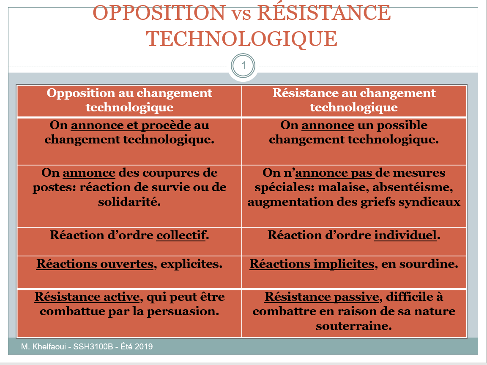

# Séance 8
# Les oppositions sociales au changements technologique


## Plan de séance
1. Opposition / résistance au changement technologique
    - Définition
    - Manifestation du phénomène 
    - Principales causes du phénomène
2. Les mouvements sociaux (MS)
    - Définition
    - Context d'apparition
    - Caractéristiques et signification des MS


### Opposition  / RCT
**Définition**
- Ensemble de réactions négatives, **explicites(opposition) ou implicites(résistance)**, à l'endroit d'un projet de changement technologiques.

**La RCT**
- Phénomène **limité dans le temps**.
- S'observe surtout à la **fin de la situation initiale** (A) et **pendant la période de transition** (A -> B)
- Mais pas dans la nouvelle situation (B) <br>

Situation A ---> **Transition A-B** ---> Situation B --> <br>
**RCT** <br>
Situation A ---> Transition A-B ---> *Situation B* --> <br>
*Impact* <br>

ex:
- Mouvement de résistance des Luddistes (1811) et destruction des machines.
- Révolte des Canuts (1831 - 1834)
- Grèves des typographes (1971)

### Voir tableau Opposition vs Résistance


## Manifestation du phénomène
- Les gens évoquent des doutes quant à la nécessité du changement
- Ils évoquent les mérites du passé, où tout allait si bien.
- Ils se servent du projet de changement comme exemple des problèmes internes du milieu.
- Il suggèrent régulièrement de reporter l'échéance d'implantation.
- Ils souhaitent que le projet soit référé à un comité d'étude.
- Ils se livrent à des attaques personnelles envers les initiateurs du changement.
- <<grève du zèle>>

## Principales causes du phénomène
- **Le besoin de stabilité et de sécurité** : sortie de la zone de confort.
- **La peur de l'inconnu**: malaise / ambivalence.
- **La facilité de l'habitude**: effort.
- **L'identification à la situation**: discrédit/ dévalorisation.
- **L'intégrité des personnes:** impression de non-respect.
- **L'apprivoisement de l'environnement:** remise en question personnelle.
- **Le principe d'équité:** sentiment d'injustice.
- **La maîtrise des processus:** perte de contrôle.
- **La conformité aux normes:** crainte du rejet.
- **Le sentiment de déshumanisation:** perte de repères.

### Question d'examen
Vous êtes ingénieur.. Les employés ne veulent pas utiliser une nouvelle machine.

a) Identifier le phénomène relatif à cette situation: Résistance <br>
b) Identifiez trois causes de ce phénomène. <br>
    - (voir causes plus haut)

## 2. Les mouvements sociaux.

### Définition des MS:
- Toute action collective revendiquant une cause, qui vise à transformer ou à préserver l'ordre social existant.
- Exemples:
    - Les mouvements anti-nucléaire.
    - Les mouvements anti-OGM, anti-pesticides.
    - Les mouvements anticapitalistes.
### Les mouvements sociaux
- Les actions collectives des MS peuvent être:
    - Brèves ou durables.
    - Spontanées ou institutionnalisées.
    - Routinière ou spectaculaires.

### Caractéristiques des MS
- Porteurs d'un projet de société alternatif.
    - Opposition aux élites dominantes.
    - Changer la société dans son ensemble, pas juste un groupe d'individus.
- Revendication globales et non sectorielles.
- Mouvements de masse plutôt que de classe.
    - Mouvements transversaux à plusieurs groupes et classes sociales.
- Tendance à se mondialiser.
    - En réponse à la globalisation économiques, culturelle et politique en cours.

### Contexte d'apparition des MS
- Associés à la société post-industrielle (SPI)
- Déclin des luttes ouvrières liées à la société industrielle (SI).

- **La contestation:**
    - **SI**: Rapports de production et propriété.
    - **SPI**: Contrôle de l'innovation et de ses conséquences.
- **Les impacts de la technologies:**
    - **SI:** Sur le travail et les conditions de travail.
    - **SPI:** Sur la société et les conditions de vie.

**La thèse de Ulrich BECK (2001): société du risque**
- Voir Tableau envoyé 
- idem pour Alain Touraine

**Revendications identitaires nouvelles**
```
Facteurs identifiés 

    (1) Fragilisation du statut et des liens professionnels 
    (2) Fragilisation du statut et des liens sociaux.
```
## La signification des MS

- **Deux significations:**
    - **Inscription du MS dans le champ politique:** pénétration d'un système politique, dans le but d'y participer, de s'y maintenir et d'y renforcer sa position.
    - **Inscription de l'action du MS dans l'histoire:** situer l'action collective au-delà des contingences politiques.
```
Mouvements sociaux ≠ mouvements révolutionnaires
    -> Révolutionnaire est nécessairement pour le changement,   un mouvement social peut être conservateur.
Mouvements sociaux ≠ groupes de pression ou lobbies
```


